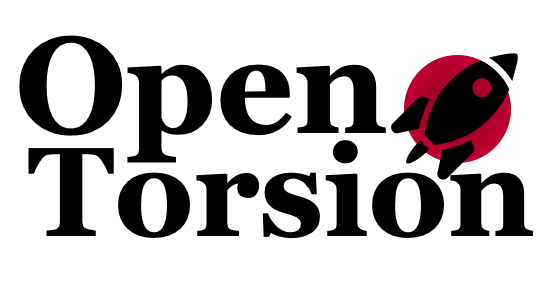
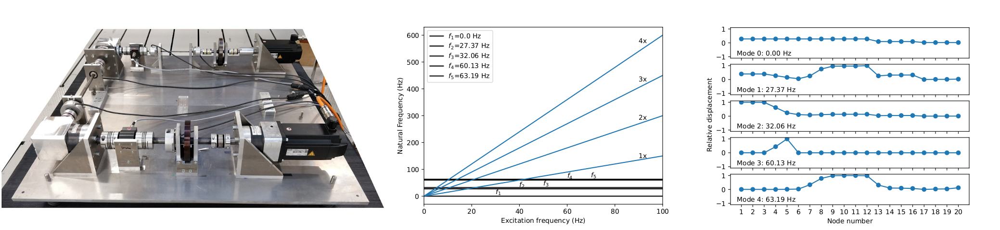

# OpenTorsion: Open-Source Backend for Torsional Vibration Analysis

[](https://pypi.org/project/opentorsion)
[](https://pypi.org/pypi/opentorsion/)
[](https://github.com/Aalto-Arotor/openTorsion)
[](https://pypistats.org/packages/opentorsion)
[](https://github.com/Aalto-Arotor/openTorsion/tree/main/opentorsion/tests)
[](https://github.com/psf/black)
[](https://github.com/Aalto-Arotor/openTorsion/blob/main/LICENSE)



Open-source software for torsional vibration analysis. Supported features include
* finite element model creation based on dimensions or datasheet specifications
* natural frequency calculation
* eigenmodes
* forced response analysis
* time-stepping simulation

## Introduction
OpenTorsion includes tools for creating shaft-line finite element models and calculation of torsional response in time or frequency domain.
Please note that the software is still in development and the authors are not able to responsibility for the functioning or effects of future changes. See the license for more information.

## Documentation

[openTorsion documentation](https://aalto-arotor.github.io/openTorsion/)

## Quickstart
Install openTorsion by running the command ```pip install opentorsion```. Folder ```opentorsion``` includes the software. Folder ```examples``` contains scripts to run example powertrains and analyses.

Make sure you have pip3 & pipenv installed in your system. Then simply running ```pipenv install``` will invoke the config files and install the necessary files in your pipenv.

Two examples are found in opentorsion/examples folder.

## Contact
The main developers are Sampo Laine and Urho Hakonen from Arotor lab at Aalto University Finland.
https://www.aalto.fi/en/department-of-mechanical-engineering/aalto-arotor-lab

For questions regarding the software please contact arotor.software@aalto.fi
