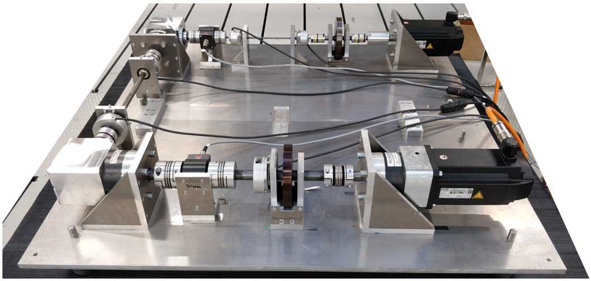

# OpenTorsion

[](https://pypi.org/project/opentorsion)
[](https://pypi.org/pypi/opentorsion/)
[](https://github.com/Aalto-Arotor/openTorsion)
[](https://pypistats.org/packages/opentorsion)

[](https://github.com/Aalto-Arotor/openTorsion/tree/main/opentorsion/tests)
[](https://github.com/psf/black)

[](https://github.com/Aalto-Arotor/openTorsion/blob/main/LICENSE)


Open-source simulator backend for torsional analysis of powertrains.

## Introduction
OpenTorsion includes tools for creating shaft-line finite element models and calculation of torsional response in time or frequency domain. OpenTorsion has the possibility of creating and including induction motor small signal model in the shaft-line FEM.
Folder ```opentorsion``` includes the software. Folder ```examples``` contains scripts to run example powertrains and analyses.




## Documentation

[openTorsion documentation](https://aalto-arotor.github.io/openTorsion/)

## Quickstart
Make sure you have pip3 & pipenv installed in your system. Then simply running ```pipenv install``` will invoke the config files and install the necessary files in your pipenv.

## Tests
Running ```pipenv run python -m unittest``` will run the the tests locally.

<!--
## Coverage report
First generate the ```.coverage``` file by running ```pipenv run coverage run -m unittest```. You can access the report easily by running ```pipenv run coverage report``` 

## TODO
The coverage reports should be ran automatically as a workflow. [Additional information](https://about.codecov.io/blog/python-code-coverage-using-github-actions-and-codecov/)

<!--
badge for coverage
[](https://codecov.io/gh/Aalto-Arotor/openTorsion)
-->
