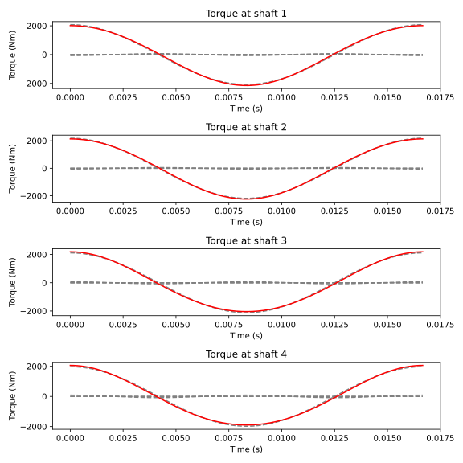

Tutorial - Steady-state forced response
===============
Forced response example. Calculating forced response requires an assembly and excitation.

.. code:: bash

    import numpy as np
    import matplotlib.pyplot as plt
    import opentorsion as ot

    # An example assembly
    # Creating 4 shaft elements using stiffness values
    # Syntax: ot.Shaft(node 1, node 2, Length [mm], outer diameter [mm], stiffness [Nm/rad])
    shaft1 = ot.Shaft(0, 1, L=None, odl=None, k=25e+6)
    shaft2 = ot.Shaft(1, 2, L=None, odl=None, k=25e+6)
    shaft3 = ot.Shaft(2, 3, L=None, odl=None, k=25e+6)
    shaft4 = ot.Shaft(3, 4, L=None, odl=None, k=25e+6)

    # Creating 5 disk elements
    # Syntax: ot.Disk(node, inertia [kgm^2])
    disk1 = ot.Disk(0, I=100)
    disk2 = ot.Disk(1, I=10)
    disk3 = ot.Disk(2, I=50)
    disk4 = ot.Disk(3, I=10)
    disk5 = ot.Disk(4, I=80)

    # Adding the elements to lists corresponding to an element type
    shafts = [shaft1, shaft2, shaft3, shaft4]
    disks = [disk1, disk2, disk3, disk4, disk5]

    # Syntax: ot.Assembly(shaft_elements, disk_elements)
    assembly = ot.Assembly(shaft_elements=shafts, disk_elements=disks)

    harmonics = np.array([1, 2, 3, 4])  # excitation harmonics, multiples of rotational frequency
    amplitudes = [200, 50, 5, 2]  # excitation amplitudes, corresponding to harmonics
    # defining an excitation matrix: a rotational speed dependent excitation is applied to node 0
    # rows correspond to assembly nodes, columns correspond to excitation frequencies
    excitation = np.zeros([assembly.dofs, len(amplitudes)])
    excitation[0] = amplitudes

    w = 3600*(2*np.pi)/60  # base rotational frequency
    t = np.linspace(0, (2*np.pi)/w, 200)  # time, used for plotting
    omegas = w*harmonics  # array of excitation frequencies

    # steady-state response
    q_res, w_res = assembly.ss_response(excitation, omegas)

    # angle difference between two consecutive nodes
    q_difference = (q_res.T[:, 1:] - q_res.T[:, :-1]).T

    # initiate 4 subplots for the 4 shafts
    fig, axes = plt.subplots(4, 1, figsize=(8, 8))

    # Shaft stiffness values are used to calculate the torque from the angle differences
    shaft_stiffness = [25e+6, 25e+6, 25e+6, 25e+6]

    # Loop over the 4 shafts to plot the response for each of them
    for n in range(4):
        shaft_response = q_difference[n]
        sum_wave = np.zeros_like(t)
        # Loop over the harmonic components and cumulate the result
        for i, (response_component, harmonic) in enumerate(zip(shaft_response, harmonics)):
            # Get the waveform of each response component
            this_wave = np.real(response_component*np.exp(1.0j*harmonic*w*t))

            # Cumulate the sum wave
            sum_wave += this_wave

            # Plot the individual component in newton meters
            axes[n].plot(t, this_wave*shaft_stiffness[n], '--', c='gray')

        # Plot the sum excitation signal in newton meters
        axes[n].plot(t, sum_wave*shaft_stiffness[n], c='red')

        axes[n].set_title(f'Torque at shaft {n+1}')
        axes[n].set_xlabel('Time (s)')
        axes[n].set_ylabel('Torque (Nm)')
    plt.tight_layout()
    plt.show()

