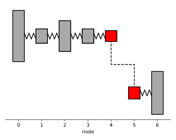

Tutorial - Modelling
====================
OpenTorsion is a Python library for torsional vibration analysis. OpenTorsion includes tools for creating shaft-line finite element models and running torsional vibration analyses.

OpenTorsion's modelling method is based on the shaft-line finite element method [#Fri2010]_. Torsional vibration models are created using lumped elements with inertia, stiffness and damping. Elements supported in openTorsion include ``Shaft``, ``Disk`` and ``Gear``, defined in their respective classes. The elements are then combined into an ``Assembly``, which represents a system model. Below, an example system is modelled using openTorsion.

.. code:: bash

    import opentorsion as ot

    # Creating 4 shaft elements using stiffness values
    # Syntax: ot.Shaft(node 1, node 2, Length [mm], outer diameter [mm], stiffness [Nm/rad])
    shaft1 = ot.Shaft(0, 1, L=None, odl=None, k=25e+6)
    shaft2 = ot.Shaft(1, 2, L=None, odl=None, k=25e+6)
    shaft3 = ot.Shaft(2, 3, L=None, odl=None, k=25e+6)
    shaft4 = ot.Shaft(3, 4, L=None, odl=None, k=25e+6)

    # Creating a hollow shaft using dimension and material parameter values
    # Syntax: ot.Shaft(node 1, node 2, Length [mm], outer diameter [mm], inner diameter [mm], shear modulus [Pa], density [kg/m^3])
    shaft5 = ot.Shaft(5, 6, L=400, odl=80, idl=40, G=79e9, rho=7850)

    # Creating 5 disk elements
    # Syntax: ot.Disk(node, inertia [kgm^2])
    disk1 = ot.Disk(0, I=100)
    disk2 = ot.Disk(1, I=10)
    disk3 = ot.Disk(2, I=50)
    disk4 = ot.Disk(3, I=10)
    disk5 = ot.Disk(4, I=80)
    disk6 = ot.Disk(6, I=80)

    # Creating a gear element
    # Gears consist of a parent gear and one or more child gear
    # Syntax: ot.Gear(node, inertia [kgm^2], gear radius [mm], parent)
    gear1 = ot.Gear(4, I=2, R=50, parent=None)  # parent gear
    gear2 = ot.Gear(5, I=5, R=150, parent=gear1)  # child gear

    # Adding the elements to lists corresponding to an element type
    shafts = [shaft1, shaft2, shaft3, shaft4, shaft5]
    disks = [disk1, disk2, disk3, disk4, disk5, disk6]
    gears = [gear1, gear2]

    # Syntax: ot.Assembly(shaft_elements, disk_elements, gear_elements)
    assembly = ot.Assembly(shaft_elements=shafts, disk_elements=disks, gear_elements=gears)

    # Assembly can be visualized using openTorsion plotting tools.
    plot_tools = ot.Plots(assembly)  # initialize plot tools
    plot_tools.plot_assembly()

..
   1. Shaft element
   ----------------
   Shaft element has two torsional degrees of freedom, i.e., two nodes. Nodes describe the connections of elements and their relative positions in the assembly. ``Shaft`` has a left node ``nl`` and a right node ``nr``. Nodes should be defined with care to ensure the elements are connected correctly. ``Shaft`` requires a torsional stiffness value ``k``. Additionally, inertia ``I`` and damping ``c`` values can be provided.

   Alternatively, a shaft with a constant circular cross-section can be defined using values of length ``L``, outer diameter ``odl``, inner diameter ``idl``, material density ``rho`` and shear modulus ``G``, which are used to calculate torsional stiffness and mass moment of inertia.

   2. Disk element
   ---------------
   Disk elements represent lumped masses, i.e., components which add inertia to the system but the stiffness can be neglected. ``Disk`` takes as parameters a node number ``n`` and mass moment of inertia ``I``. Damping and torsional stiffness values can also be given for the disk element if desired.

   3. Gear element
   ---------------
   Gear elements are used to model gear drives. Gears consist of a parent gear and one or more child gear, i.e., a gear can have multiple children but only one parent. ``Gear`` takes as parameters a node number ``n``, mass moment of inertia ``I`` and gear radius ``R``. The value ``R`` can be either gear radius, teeth count or gear ratio as long as the use is constant.

   4. Assembly
   -----------
   Assembly represents a complete system model. ``Assembly`` takes as parameters lists, each containing elements of one type.

See :doc:`analyses` for an introduction on performing torsional vibration analyses using openTorsion.

.. rubric:: References

.. [#Fri2010] Friswell MI, Penny JET, Garvey SD, Lees AW. Dynamics of Rotating Machines. Cambridge University Press; 2010.
